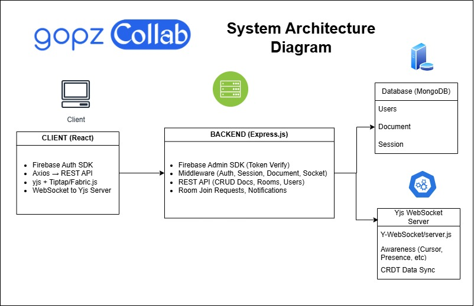
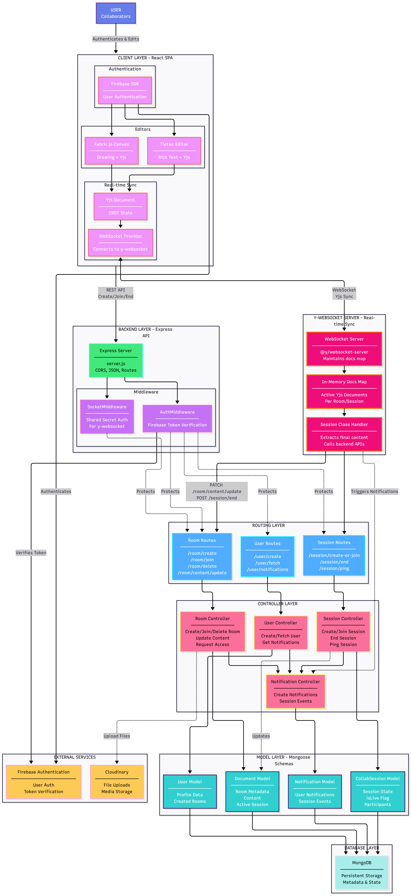

# 🌍 GopzCollab – Real-Time Global Collaboration Platform

GopzCollab is a modern real-time collaboration platform built for teams and individuals to communicate, share content, and work seamlessly — globally and instantly.

> ✨ Created by [Gopi C K](https://github.com/gopi-c-k) and [Gopika A](https://github.com/Gopikakavi)

---

## 🔐 Authentication Powered by Firebase

- 🔗 Google Sign-In
- 📧 Email/Password Login
- 🔁 Persistent Sessions
- 🔒 Secure Token-Based Backend Access

---

## 🧠 Tech Stack

| Layer         | Technology                                        |
|-------------- |-------------------------------------------------- |
| Frontend      | React, Firebase Auth SDK                         |
| Backend       | Node.js, Express, Firebase Admin SDK, MongoDB    |
| Auth          | Firebase Authentication                          |
| Real-time     | Yjs + WebSocket (Collaborative Text & Canvas Editing) |
| Text Editor   | Tiptap + Yjs                                      |
| Canvas Editor | Fabric.js + Yjs                                   |
| Deployment    | Vercel (Frontend), Render (Backend & WebSocket)  |
| Repo Type     | Monorepo (`/client`, `/server`, `/y-websocket`) |


---

## Architecture Diagram



---

## Demo Video
[](https://www.youtube.com/watch?v=hx0Thp8EOwk)

---

## 📁 Folder Structure

```
Directory structure:
└── gopi-c-k-gopzcollab/
    ├── README.md
    ├── client/
    │   ├── README.md
    │   ├── package.json
    │   ├── postcss.config.js
    │   ├── tailwind.config.js
    │   ├── public/
    │   │   ├── index.html
    │   │   ├── manifest.json
    │   │   └── robots.txt
    │   └── src/
    │       ├── App.css
    │       ├── App.js
    │       ├── App.test.js
    │       ├── firebase.js
    │       ├── index.css
    │       ├── index.js
    │       ├── reportWebVitals.js
    │       ├── setupTests.js
    │       ├── api/
    │       │   ├── axiosInstance.js
    │       │   └── storeToken.js
    │       ├── components/
    │       │   ├── Message.js
    │       │   └── Notification.js
    │       └── pages/
    │           ├── Hero.js
    │           ├── Home.js
    │           ├── Notification.js
    │           ├── Sample.js
    │           ├── SignIn.js
    │           ├── SignUp.js
    │           └── TextEditor.js
    ├── Server/
    │   ├── firebase.js
    │   ├── firebaseConfig.js
    │   ├── package.json
    │   ├── server.js
    │   ├── config/
    │   │   ├── cloudinary.js
    │   │   └── db.js
    │   ├── controllers/
    │   │   ├── documentControllers/
    │   │   │   ├── createDocumentController.js
    │   │   │   ├── deleteDocumentController.js
    │   │   │   ├── getRoomDetailsController.js
    │   │   │   ├── joinDocumentController.js
    │   │   │   ├── requestToJoinRoomController.js
    │   │   │   └── updateDocumentContentController.js
    │   │   ├── imageControllers/
    │   │   │   └── uploadRouter.js
    │   │   ├── notificationControllers/
    │   │   │   └── getNotification.js
    │   │   ├── sessionControllers/
    │   │   │   ├── createOrJoinDocumentSession.js
    │   │   │   └── endDocumentSessionController.js
    │   │   └── usercontrollers/
    │   │       ├── fetchUserController.js
    │   │       └── userCreationController.js
    │   ├── middleware/
    │   │   ├── AuthMiddleware.js
    │   │   ├── DocumentMiddleware.js
    │   │   ├── SessionMiddleware.js
    │   │   └── SocketMiddleware.js
    │   ├── models/
    │   │   ├── collabSession.js
    │   │   ├── document.js
    │   │   ├── notification.js
    │   │   └── user.js
    │   └── routes/
    │       ├── documentRoute.js
    │       ├── sessionRoute.js
    │       └── userRoute.js
    └── y-websocket/
        ├── package.json
        └── server.js


````

---

## 🚀 Getting Started Locally

### 1. Clone the Repo

```bash
git clone https://github.com/gopi-c-k/gopzCollab.git
cd gopzCollab
````

---

### 2. Set Up Firebase Project

* Go to [Firebase Console](https://console.firebase.google.com)
* Create project named **GopzCollab**
* Add Web App → Get the Firebase config keys
* Enable **Google Sign-In** and **Email/Password Sign-In**
* Generate Firebase Admin SDK (Service Account JSON) for backend usage

---

### 3. Frontend Setup (`/client`)

```bash
cd client
npm install
```

➡️ Create `.env` file inside `/client` folder:

```
REACT_APP_API_KEY=
REACT_APP_AUTH_DOMAIN=
REACT_APP_PROJECT_ID=
REACT_APP_STORAGE_BUCKET=
REACT_APP_MESSAGE_SENDER_ID=
REACT_APP_APP_ID=
REACT_APP_MEASUREMENT_ID=
REACT_APP_SOCKET_URL=
REACT_APP_BACKEND_URL=
```

---

### 4. Backend Setup (`/server`)

```bash
cd ../server
npm install
```

➡️ Create `.env` file inside `/server` folder:

```
DB_PASSWORD=
DB_URI=
PORT=

FIREBASE_TYPE=
FIREBASE_PROJECT_ID=
FIREBASE_PRIVATE_KEY_ID=
FIREBASE_PRIVATE_KEY=
FIREBASE_CLIENT_EMAIL=
FIREBASE_CLIENT_ID=
FIREBASE_AUTH_URI=
FIREBASE_TOKEN_URI=
FIREBASE_AUTH_PROVIDER_CERT_URL=
FIREBASE_CLIENT_CERT_URL=
FIREBASE_UNIVERSE_DOMAIN=

CLOUDINARY_CLOUD_NAME=
CLOUDINARY_API_KEY=
CLOUDINARY_API_SECRET=

SOCKET_SECRET_KEY=
```

---

### 5. WebSocket Server Setup (`/y-websocket`)

```bash
cd ../y-websocket
npm install
```

➡️ Create `.env` file inside `/y-websocket` folder:

```
PORT=
BACKEND_URL=
SECRET_KEY=
```

---

### 6. Run Locally

```bash
# Backend
cd server
node server.js

# WebSocket Server
cd ../y-websocket
node server.js

# Frontend
cd ../client
npm start
```

---

Frontend → [http://localhost:3000](http://localhost:3000)
Backend → [http://localhost:5000](http://localhost:5000)
WebSocket → ws\://localhost:1235

---

## ✅ ✅ Completed Features

* ✅ Google & Email Login
* ✅ Firebase Token Verification (Backend Protected Routes)
* ✅ Document Creation / Room Management
* ✅ Notification System (Join Requests, Accept/Reject, Room Updates)
* ✅ File Upload (DOCX, HTML) via Cloudinary
* ✅ Real-time Text Collaboration using Yjs + WebSocket
* ✅ Room Join / Request Join Flow
* ✅ Document Details and Room Listing

---

## ⚙️ 🚧 Features In Progress

* 🚧 **Collaborative Code Editor (Coming Soon)**
  (Currently single-user mode at [`/code-editor`](https://gopz-collab.vercel.app/code-editor) → No live collaboration yet)

---

## ☁️ Deployment Details

| Service   | Platform | URL                                                                |
| --------- | -------- | ------------------------------------------------------------------ |
| Frontend  | Vercel   | [https://gopz-collab.vercel.app/](https://gopz-collab.vercel.app/) |
| Backend   | Render   |                                            |
| WebSocket | Render   |                                        |

---

## 🧪 .env Variables Explained

| Environment      | Variable                            | Description                                   |
| ---------------- | ----------------------------------- | --------------------------------------------- |
| Client (React)   | REACT\_APP\_API\_KEY                | Firebase Web API Key                          |
| Client           | REACT\_APP\_AUTH\_DOMAIN            | Firebase Auth Domain                          |
| Client           | REACT\_APP\_PROJECT\_ID             | Firebase Project ID                           |
| Client           | REACT\_APP\_STORAGE\_BUCKET         | Firebase Storage Bucket                       |
| Client           | REACT\_APP\_MESSAGE\_SENDER\_ID     | Firebase Messaging Sender ID                  |
| Client           | REACT\_APP\_APP\_ID                 | Firebase App ID                               |
| Client           | REACT\_APP\_MEASUREMENT\_ID         | Firebase Analytics Measurement ID             |
| Client           | REACT\_APP\_SOCKET\_URL             | WebSocket server URL                          |
| Client           | REACT\_APP\_BACKEND\_URL            | Backend server base URL                       |
| Server (Node.js) | DB\_PASSWORD                        | MongoDB password                              |
| Server           | DB\_URI                             | Full MongoDB connection string                |
| Server           | PORT                                | Backend server port                           |
| Server           | FIREBASE\_TYPE                      | Firebase Admin Type                           |
| Server           | FIREBASE\_PROJECT\_ID               | Firebase Project ID                           |
| Server           | FIREBASE\_PRIVATE\_KEY\_ID          | Firebase Private Key ID                       |
| Server           | FIREBASE\_PRIVATE\_KEY              | Firebase Admin Private Key (multiline string) |
| Server           | FIREBASE\_CLIENT\_EMAIL             | Firebase Admin Client Email                   |
| Server           | FIREBASE\_CLIENT\_ID                | Firebase Admin Client ID                      |
| Server           | FIREBASE\_AUTH\_URI                 | Firebase Auth URI                             |
| Server           | FIREBASE\_TOKEN\_URI                | Firebase Token URI                            |
| Server           | FIREBASE\_AUTH\_PROVIDER\_CERT\_URL | Firebase Cert Provider URL                    |
| Server           | FIREBASE\_CLIENT\_CERT\_URL         | Firebase Client Cert URL                      |
| Server           | FIREBASE\_UNIVERSE\_DOMAIN          | Firebase Universe Domain                      |
| Server           | CLOUDINARY\_CLOUD\_NAME             | Cloudinary Cloud Name                         |
| Server           | CLOUDINARY\_API\_KEY                | Cloudinary API Key                            |
| Server           | CLOUDINARY\_API\_SECRET             | Cloudinary API Secret                         |
| Server           | SOCKET\_SECRET\_KEY                 | Secret key for WebSocket validation           |
| y-websocket      | PORT                                | WebSocket server port                         |
| y-websocket      | BACKEND\_URL                        | Backend URL for auth checks                   |
| y-websocket      | SECRET\_KEY                         | Secret key for client verification            |

---

## 🙋‍♂️ Creators

Built with ❤️ by:

* [Gopi C K](https://github.com/gopi-c-k)
* [Gopika A](https://github.com/Gopikakavi)

---

## 🏁 License

MIT License – Open for contributions and collab!

